# Classification & Logistic Regression Modeling - Risky Business


## Background

Auto loans, mortgages, student loans, debt consolidation ... these are just a few examples of credit and loans that people are seeking online. Peer-to-peer lending services such as LendingClub or Prosper allow investors to loan other people money without the use of a bank. However, investors always want to mitigate risk, so you have been asked by a client to help them use machine learning techniques to predict credit risk.

Here we will build and evaluate various machine-learning models to predict credit risk using LendingClub data. Also, credit risk is an inherently imbalanced classification problem (the number of good loans is much higher than the number of at-risk loans). We will employ different imbalanced-learn and Scikit libraries for training and evaluating models with imbalanced class using the following 2 techniques:


1. [Resampling](#Resampling)
2. [Ensemble Learning](#Ensemble-Learning)

- - -

### Files

[Resampling Starter Notebook](Starter_Code/credit_risk_resampling.ipynb)

[Ensemble Starter Notebook](Starter_Code/credit_risk_ensemble.ipynb)

[Lending Club Loans Data](Instructions/Resources/LoanStats_2019Q1.csv.zip)

- - -

#### Resampling

Use of the [imbalanced learn](https://imbalanced-learn.readthedocs.io) library to resample the LendingClub data and build and evaluate logistic regression classifiers using the resampled data.

<details>
<summary>Imbalanced classification algorithms</summary><br>
    
1. **Oversampling of the data using the `Naive Random Oversampler` and `SMOTE` algorithms**
    
    * Naive Random OverSampler:
    
    ```
        # Resample the training data with the RandomOversampler
        from imblearn.over_sampling import RandomOverSampler
        ros = RandomOverSampler(random_state=1)
        X_resampled, y_resampled = ros.fit_resample(X_train, y_train)
     ```
     
    * SMOTE OverSampler:
    
    ```
        from imblearn.over_sampling import SMOTE
        X_resampled, y_resampled = SMOTE(random_state=1, sampling_strategy=1.0).fit_resample(X_train, y_train)
    ```
2. **Undersampling of the data using the `Cluster Centroids` algorithm**
    ```
        from imblearn.under_sampling import ClusterCentroids
        undersample = ClusterCentroids(random_state=1, n_jobs=1)
        X_resampled, y_resampled = undersample.fit_resample(X_train, y_train)
    ```
3. **Over- and under-sampling using a combination `SMOTEENN` algorithm**
    ```
        from imblearn.combine import SMOTEENN
        sm = SMOTEENN(random_state=1)
        X_resampled, y_resampled = sm.fit_resample(X_train, y_train)
    ```
</details>

<details>
<summary>Metrics Calculation</summary><br>    

Following steps were performed for each of the algorithm:

1. Train a `logistic regression classifier` from `sklearn.linear_model` using the resampled data.
    ```
        from sklearn.linear_model import LogisticRegression
        model_ros = LogisticRegression(solver='liblinear', random_state=1)
        model_ros.fit(X_resampled, y_resampled)
    ```

2. Calculate the `balanced accuracy score` from `sklearn.metrics` 
3. Calculate the `confusin matrix` from `sklearn.metrics`
4. Print the `imbalanced classification report` from `imblearn.metrics`


Models                      |Accuracy Score          |Confusion Matrix                  | Classification Report 
:-------------------------:|:-------------------------:|:-------------------------:|:-------------------------:
*Random OverSampling* |0.7448 |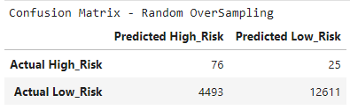|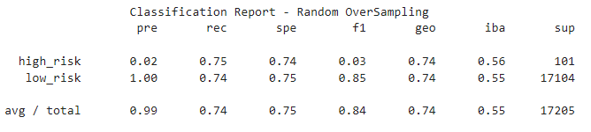
*SMOTE OverSampling* | 0.7130|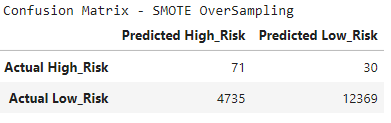|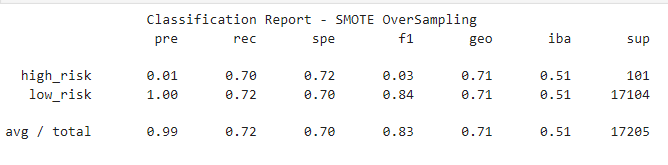
*ClusterCentroids UnderSampling* | 0.6469 | 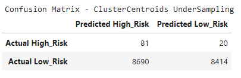|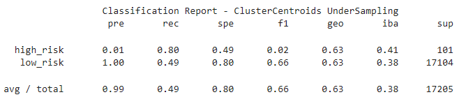
*SMOTEENN Combination Sampling* |0.6917 | 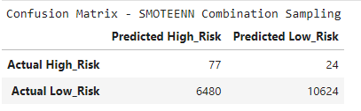|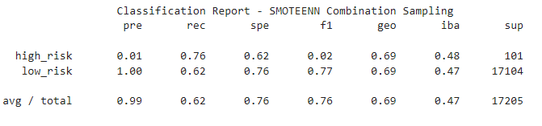

</details>

<details>
<summary>Performance Summary</summary><br>    

Use the above to answer the following:

> Which model had the best balanced accuracy score?<br/>
    `Naive Random OverSampler`<br/><br/>
> Which model had the best recall score?<br/>
    `Naive Random OverSampler`<br/><br/>
> Which model had the best geometric mean score?<br/>
    `Naive Random OverSampler` <br/><br/>
 
</details>

#### Ensemble Learning

Use of the `balanced random forest classifier` and the `easy ensemble AdaBoost classifier` to predict loan risk and evaluate each model.

<details>
<summary>Ensemble classification algorithms</summary><br>    

1. **Balanced Random Forest Classifier**
     ```
        # Resample the training data with the BalancedRandomForestClassifier
        from imblearn.ensemble import BalancedRandomForestClassifier
        brf = BalancedRandomForestClassifier(n_estimators=100, random_state=1, n_jobs=1)
        brf_model = brf.fit(X_train, y_train)
     ```
     
2. **Easy Ensemble AdaBoost Classifier**
    ```
        ## Resample the training data with the Easy Ensemble AdaBoost Classifier
        from imblearn.ensemble import EasyEnsembleClassifier
        eec = EasyEnsembleClassifier(random_state=1, n_jobs=1, n_estimators=100)
        eec_model = eec.fit(X_train, y_train)
     ```
</details>

<details>
<summary>Metrics Calculations</summary><br>  
    

Following Steps were performed:

1. Train the model using the quarterly data from LendingClub provided in the `Resource` folder.
    ```
        from sklearn.model_selection import train_test_split
        X_train, X_test, y_train, y_test = train_test_split(X, y, random_state=1)
    ```

2. Calculate the balanced accuracy score from `sklearn.metrics`.
3. Print the confusion matrix from `sklearn.metrics`.
4. Generate a classification report using the `imbalanced_classification_report` from imbalanced learn.

Models                      |Accuracy Score          |Confusion Matrix                  | Classification Report 
:-------------------------:|:-------------------------:|:-------------------------:|:-------------------------:
*Balanced Random Forest Classifier* |0.7855 |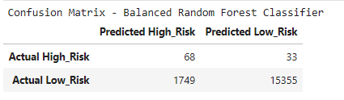|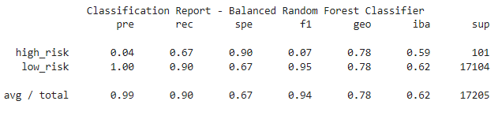
*Easy Ensemble AdaBoost Classifier* | 0.9316|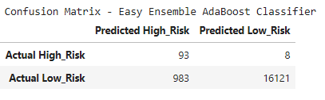|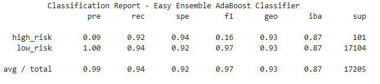


5. For the balanced random forest classifier only, print the feature importance sorted in descending order (most important feature to least important) along with the feature score.

    ```
            Features
    [(0.09175752102205247, 'total_rec_prncp'),
     (0.06410003199501778, 'total_pymnt_inv'),
     (0.05764917485461809, 'total_pymnt'),
     (0.05729679526683975, 'total_rec_int'),
     (0.05174788106507317, 'last_pymnt_amnt'),
     (0.031955619175665397, 'int_rate'),
     (0.02353678623968216, 'issue_d_Jan-2019'),
     (0.017078915518993903, 'installment'),
     (0.017014861224701222, 'mths_since_recent_inq'),
     (0.016537957646730293, 'out_prncp_inv'),
     (0.016169718411077325, 'max_bal_bc'),
     (0.01607049983545137, 'dti'),
     (0.01599866290723441, 'revol_bal'),
     (0.015775537221600675, 'annual_inc'),
     (0.01535560674178928, 'tot_hi_cred_lim'),
     (0.015029265003541079, 'mo_sin_old_rev_tl_op'),
     (0.014828006488636946, 'out_prncp'),
     (0.01464881608833323, 'total_bc_limit'),
     (0.014402430445752665, 'total_bal_il'),
     (0.014318832248876989, 'mths_since_rcnt_il'),
     (0.013519867193755364, 'issue_d_Mar-2019'),
     (0.013151520216882331, 'il_util'),
     (0.013101578263049833, 'total_il_high_credit_limit'),
     (0.012784600558682344, 'bc_util'),
     (0.012636608914961465, 'total_bal_ex_mort'),
     (0.012633464965390648, 'avg_cur_bal'),
     (0.012406321468566728, 'total_rev_hi_lim'),
     (0.011687404692448701, 'mo_sin_old_il_acct'),
     (0.01156494245653799, 'all_util'),
     (0.011455878011762288, 'num_rev_accts'),
     (0.011409157520644688, 'bc_open_to_buy'),
     (0.01073641504525053, 'tot_cur_bal'),
     (0.010380085181706624, 'acc_open_past_24mths'),
     (0.010097528131347774, 'mths_since_recent_bc'),
     (0.00995373830638152, 'loan_amnt'),
     (0.00991410213601043, 'pct_tl_nvr_dlq'),
     (0.009821715826953788, 'num_il_tl'),
     (0.009603648248133598, 'inq_last_12m'),
     (0.009537423049553, 'num_actv_rev_tl'),
     (0.008976776055926955, 'total_acc'),
     (0.008870623013604539, 'num_bc_tl'),
     (0.008745106187024114, 'num_op_rev_tl'),
     (0.008045578273709669, 'mo_sin_rcnt_tl'),
     (0.007906251501807723, 'next_pymnt_d_Apr-2019'),
     (0.00782073260901301, 'open_acc'),
     (0.007798696767389274, 'num_sats'),
     (0.007608045628523077, 'inq_fi'),
     (0.0075861537897335815, 'num_bc_sats'),
     (0.007554511001273182, 'num_tl_op_past_12m'),
     (0.007471884930172615, 'open_acc_6m'),
     (0.007273779915807858, 'num_rev_tl_bal_gt_0'),
     (0.006874845464745796, 'mort_acc'),
     (0.006862142977394886, 'total_cu_tl'),
     (0.006838718858820505, 'percent_bc_gt_75'),
     (0.006413554699909871, 'open_il_24m'),
     (0.006319439816216779, 'mo_sin_rcnt_rev_tl_op'),
     (0.006160469432535709, 'num_actv_bc_tl'),
     (0.006066257227997291, 'open_rv_12m'),
     (0.005981472544437747, 'total_rec_late_fee'),
     (0.0055301594524349495, 'open_act_il'),
     (0.004961823663836347, 'issue_d_Feb-2019'),
     (0.004685198497435334, 'next_pymnt_d_May-2019'),
     (0.0045872929977180356, 'open_rv_24m'),
     (0.0041651633321967895, 'inq_last_6mths'),
     (0.004016461341161775, 'open_il_12m'),
     (0.0032750717701661657, 'delinq_2yrs'),
     (0.0027565184136781346, 'verification_status_Not Verified'),
     (0.0026174030074401656, 'num_accts_ever_120_pd'),
     (0.002279671873697176, 'home_ownership_MORTGAGE'),
     (0.0021899772867773103, 'tot_coll_amt'),
     (0.0020851101815353096, 'home_ownership_RENT'),
     (0.0018404849590376573, 'home_ownership_OWN'),
     (0.001736019018028134, 'verification_status_Verified'),
     (0.0015472230884974506, 'verification_status_Source Verified'),
     (0.0012263315437383057, 'application_type_Joint App'),
     (0.0012213148580230454, 'application_type_Individual'),
     (0.0012151288883862276, 'pub_rec_bankruptcies'),
     (0.0008976722260399365, 'pub_rec'),
     (0.0008125182396705508, 'initial_list_status_w'),
     (0.000573414997420326, 'num_tl_90g_dpd_24m'),
     (0.0005168345750594915, 'collections_12_mths_ex_med'),
     (0.0004192455022893127, 'initial_list_status_f'),
     (0.0, 'tax_liens'),
     (0.0, 'recoveries'),
     (0.0, 'pymnt_plan_n'),
     (0.0, 'policy_code'),
     (0.0, 'num_tl_30dpd'),
     (0.0, 'num_tl_120dpd_2m'),
     (0.0, 'home_ownership_ANY'),
     (0.0, 'hardship_flag_N'),
     (0.0, 'delinq_amnt'),
     (0.0, 'debt_settlement_flag_N'),
     (0.0, 'collection_recovery_fee'),
     (0.0, 'chargeoff_within_12_mths'),
     (0.0, 'acc_now_delinq')]
     ```
</details>

<details>
<summary>Performance Summary</summary><br>
    
Use the above to answer the following:

> Which model had the best balanced accuracy score?<br/>
> `Easy Ensemble AdaBoost Classifier`<br/><br/>
> Which model had the best recall score?<br/>
> `Easy Ensemble AdaBoost Classifier`<br/><br/>
> Which model had the best geometric mean score?<br/>
> `Easy Ensemble AdaBoost Classifier`<br/><br/>
> What are the top three features?<br/>
    * 0.09175752102205247: total_rec_prncp<br/>
    * 0.06410003199501778: total_pymnt_inv<br/>
    * 0.05764917485461809: total_pymnt<br/>
    

- - -


